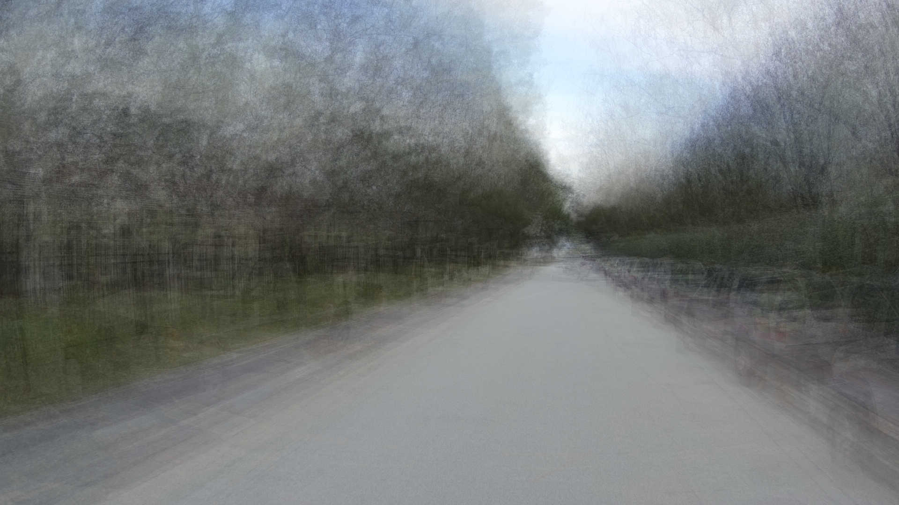
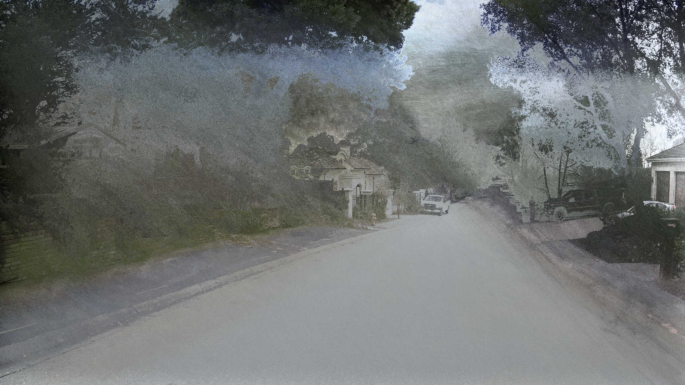

# Palimpsest

The goal of this project is to provide a framework for merging photos. 

## Steps

`palimpsest` allows one to merge photos by write a pixel by pixel indexer. The indexer must provide these functions properties on a `indexer` object like `{declare, allocate, assign}`. These function all take the below explained `input object` and must return the value their explanations below indicate.

**Input Object**

The input object is comprised of the following attributes and represents a single pixel. It is sent to all modes as `opts`.

- color: an object with `{r, g, b}` where each color channel is a number between 0 and 255.
- loc: an object with `{x, y, s}` where `x` is the `x` coordinate of the pixel, `y` is the `y` coordinate and `s` indicates which image the pixel is from in the series.
- progress: an object with `{x, y, s}` where each attribute is the percent version the `loc` eqivilant.
- about: an object with `{numSeries, width, height}` where each is a number.

### declare (input) -> String

Define the index key of the provided pixel. This function will be called a lot of times through out the process. Ideally it is stateless and will always return the same result. That said, if it doesn't no one will know.

### allocate (key, input) -> Number

Provide the weight the pixel adds its key. 

### assign (key, pixelWeight, keyWeight, input) -> {r:Number, g:Number, b:Number}

provide the color the pixels adds to its key

## Examples

