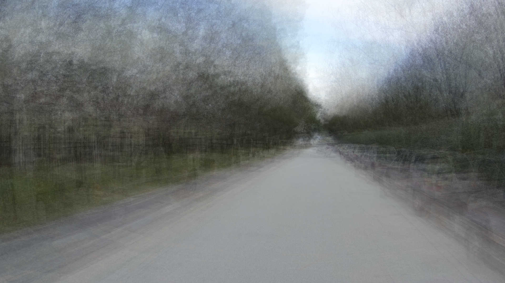

# Palimpsest

The goal of this project is to make it very easy to merge a set of pictures that are all the same size.

This project provides a cli tool that accepts three inputs.

1. The path to an indexer
2. The path to a folder of images
3. The path where the final image is saved

The indexer is a simple javascript module that exports a function. This function takes the arguments `x, y, r, g, b` and returns a string. This string can be anything. The key requirement is that the same `x, y, r, g, b` should create the MUST create the same string.

## Examples

